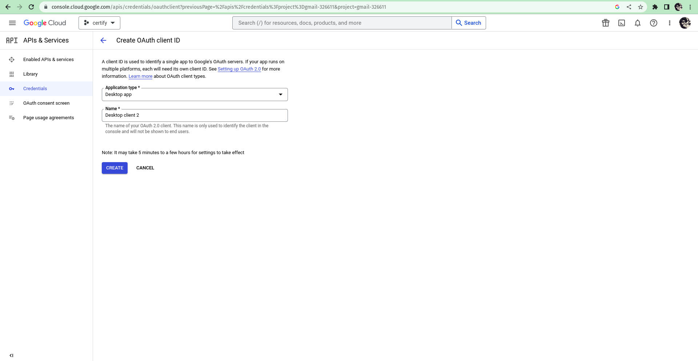

# Project CERTIFY (ONLY For LINUX)

## Description
The main objective of this project is to create the certificates with the reference to **.csv file** and a template which will be in the format of **.pptx**. we can also send these certificates to the concernt person via e-mail using Google's Mail - Api.

**note:** If you need to access the email feature in this script,
1. You need to create a project in google developer console
2. Enable Google mail api.
3. Create a Oauth 2.0 credentials with Application type as  **Desktop app**.

## **1 . How to setup the environment**

1. **Download the git repository using**
```
    $ git clone https://github.com/SPR-Ideas/Certiy.git
```
2. **Setting up the requirement**
```
    $ cd Certify/
    $ make install
```
## **2 . How to use this script.**
The only part one can use this script is via **config.yaml** file.
### **2 . 1  How to write the config.yaml file.**
The smaple config

There are some required fields and most importantly the feilds are case-sensity.

**Certify** - is the main header.**


```yaml
Certify:
    template: /home/levi/Downloads/FIP.pptx
    data: /home/levi/Downloads/FIP.csv
    save_location: certificates/

    variables:
    Full Name: Name
    email: Email

    sent_email : True # It is a optional feild default is false.

    content: text.txt  # path where the Body of the email is present [only .txt file.]
    subject : certificates for FIP

```

## **3. Initializing Mail features.**

### 1. login into google developer [console](https://play.google.com/console/signup).
### 2. Create a Project in the console.
### 3. After creating Project and go to Libary and search for Gmail Api and enable it.
### 4. After enabling the gmail api and go to credentials and click on **Create Credential->Oauth client ID -> Desktop App.**

### 5. Once all set go download your credentials.json and copy the path.
### 6. Once you run your path app for first time it gonna as the credentials.json file location just paste it.

```
Enter the credentials.json file location : Downloads/cred.json
```
